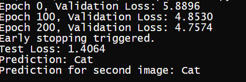

# 🧠 DeepVision-Trainer

DeepVision-Trainer is a powerful deep learning image classification tool built with a five-layer Convolutional Neural Network (CNN). Utilizing **Leaky ReLU**, **Dropout**, **He Initialization**, and the **Adam optimizer**, it achieves high accuracy and robust generalization through advanced **data augmentation** techniques.

Trained to distinguish between diverse classes with precision, such as:

<p align="center">
  
  
</p>

## 🖼️ Test Example

<p align="center">
  
</p>

## 🚀 Features

- 🧠 Deep 5-layer CNN architecture  
- 🔁 Advanced data augmentation  
- 🔒 Dropout regularization  
- ⚡ Leaky ReLU activations  
- 🧮 He Initialization  
- 🧠 Optimized with Adam  
- 🏷️ High-precision visual classification

## 📂 Dataset

Supports custom datasets. Ideal for binary and multi-class classification tasks.

## 🛠️ Installation

```bash
git clone https://github.com/yourusername/DeepVision-Trainer.git
cd DeepVision-Trainer
pip install -r requirements.txt
